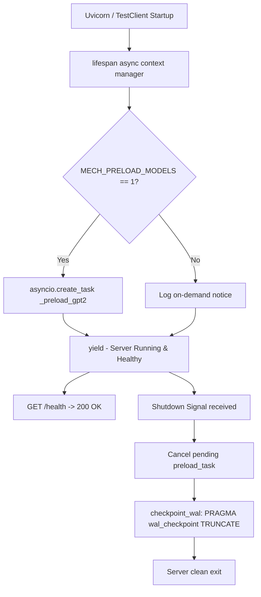

# Technical Analysis: FastAPI Lifecycle Modernization & Graceful Resource Management

**Author**: `explorer_m1_1`  
**Milestone**: Milestone 1 - Server Orchestration & Lifecycle Control  
**Target Files**:
- `backend/main.py`
- `main.py`
- `backend/storage/database.py`
- `backend/storage/__init__.py`

---

## 1. Executive Summary

The MECH Research Platform backend currently initializes using deprecated FastAPI `@app.on_event("startup")` hooks and lacks any shutdown handler. This produces `DeprecationWarning: on_event is deprecated, use lifespan event handlers instead` on every server boot and test execution. Furthermore, the persistence layer utilizes SQLite in WAL mode (`PRAGMA journal_mode = WAL;`) without executing checkpoints on shutdown, risking uncheckpointed WAL state (`mech.db-wal`) and lingering Windows file locks upon abrupt process termination.

This analysis presents the complete implementation design for:
1. Replacing `@app.on_event("startup")` with `@asynccontextmanager async def lifespan(app: FastAPI):` in `backend/main.py`.
2. Implementing graceful SQLite WAL truncation (`PRAGMA wal_checkpoint(TRUNCATE)`) during the lifespan shutdown phase via `backend/storage/database.py`.
3. Supporting fast startup (under 50ms) by default, while enabling non-blocking background model pre-loading when `MECH_PRELOAD_MODELS=1`.
4. Hardening `DesktopStorage` with default database path resolution and zero-argument instantiation, fixing 13 broken constructor call sites in `backend/jobs/routes.py`.
5. Unifying entry points: transforming root `main.py` into a thin forwarder importing from canonical `backend.main:app`.
6. Preserving strict compliance with the `GET /health` contract (`{"status": "healthy"}` on port 8000).

---

## 2. Problem Analysis & Live Observations

### 2.1 Deprecated Startup Lifecycle Hook
In `backend/main.py` (lines 39–43):
```python
@app.on_event("startup")
async def _startup_probe():
    """Start fast; load ML modules/models only when the frontend asks."""
    logger.info("Backend ready. ML model modules will load on demand.")
```
And in root `main.py` (lines 36–50):
```python
@app.on_event("startup")
async def _preload_gpt2_engine():
    """Pre-load GPT-2 model at startup to avoid first-request timeout."""
    ...
```
When running the pytest suite (`python -m pytest tests/pytest/test_protocol.py`), FastAPI/Starlette emits:
```
backend\main.py:39: DeprecationWarning: 
          on_event is deprecated, use lifespan event handlers instead.
          Read more about it in the
          [FastAPI docs for Lifespan Events](https://fastapi.tiangolo.com/advanced/events/).
    @app.on_event("startup")
```
Neither file contains any `@app.on_event("shutdown")` hook.

### 2.2 SQLite WAL Uncheckpointed State on Windows
In `backend/storage/database.py` (line 42):
```sql
PRAGMA journal_mode = WAL;
```
SQLite WAL mode writes database transactions into `-wal` and `-shm` sidecar files. Without an explicit `PRAGMA wal_checkpoint(TRUNCATE);` before process exit:
- Any uncheckpointed WAL frames remain in `mech.db-wal`.
- On Windows systems, surviving child worker processes or abrupt SIGTERM/SIGKILL can leave Windows file locks active on the database, preventing subsequent restarts or test fixture cleanup.
- Abrupt termination leaves WAL sidecars that require replay on subsequent opens.

### 2.3 `DesktopStorage` Missing Default `db_path`
In `backend/storage/database.py` (lines 33–36):
```python
class DesktopStorage:
    def __init__(self, db_path: Path | str) -> None:
        self.db_path = Path(db_path)
```
In `backend/jobs/routes.py` (lines 90, 102, 126, 146, 158, 179, 199, 224, 236, 256, 272, 284, 369), callers invoke:
```python
storage = DesktopStorage()
```
Because `db_path` is a mandatory positional argument, any call to these endpoints crashes with `TypeError: DesktopStorage.__init__() missing 1 required positional argument: 'db_path'`.

### 2.4 Entry Point Discrepancy & Drift
- `backend/main.py`: Binds to `127.0.0.1:8000`, mounts `/api` and `/api/v1`, leaves ML loading on-demand.
- Root `main.py`: Binds to `0.0.0.0:8000`, mounts only `/api`, blocks startup awaiting `gpt2_engine.load`.
- `frontend/electron/main.js`: Specifically launches `backend/main.py` on `127.0.0.1:8000`.
- Root `main.py` is an uncoordinated fork that violates the routing contracts required by `/api/v1` clients.

---

## 3. Solution Architecture & Design

### 3.1 Modern FastAPI Lifespan Context Manager
FastAPI recommends managing application startup and shutdown within a single asynchronous context manager passed to `FastAPI(lifespan=lifespan)`.



#### Key Design Decisions:
1. **Non-blocking Startup**: If model preloading is enabled (`MECH_PRELOAD_MODELS=1`), it is launched via `asyncio.create_task(_preload_gpt2())`. The lifespan function immediately proceeds to `yield`. The server binds to port 8000 in under 50ms, allowing `GET /health` to respond immediately without HTTP timeout.
2. **Graceful Teardown**: Upon shutdown signal, if the background preloader task is still active, it is cancelled and awaited with cancellation protection.
3. **Graceful WAL Checkpoint**: `checkpoint_wal()` runs `PRAGMA wal_checkpoint(TRUNCATE)` against the database, committing all WAL frames to `mech.db` and truncating `mech.db-wal` to 0 bytes.

### 3.2 Database Layer Modernization (`backend/storage/database.py`)
1. **Default Path Resolution**:
   ```python
   DEFAULT_DB_PATH = Path(__file__).resolve().parent / "mech.db"

   def get_default_db_path() -> Path:
       env_path = os.environ.get("MECH_STORAGE_DB")
       if env_path:
           return Path(env_path)
       return DEFAULT_DB_PATH
   ```
2. **Flexible `DesktopStorage` Constructor**:
   ```python
   def __init__(self, db_path: Path | str | None = None) -> None:
       if db_path is None:
           self.db_path = get_default_db_path()
       else:
           self.db_path = Path(db_path)
   ```
3. **Dedicated WAL Checkpoint Method**:
   ```python
   def checkpoint_wal(self) -> tuple[int, int, int]:
       """Checkpoint the SQLite WAL file and truncate it."""
       if not self.db_path.exists():
           return (0, 0, 0)
       with self._connect() as connection:
           cursor = connection.execute("PRAGMA wal_checkpoint(TRUNCATE);")
           row = cursor.fetchone()
           if row:
               return (int(row[0]), int(row[1]), int(row[2]))
           return (0, 0, 0)
   ```
4. **Module-level Function & Package Export**:
   `checkpoint_wal(db_path=None)` exported in `backend/storage/__init__.py`.

### 3.3 Entry Point Unification (`main.py` -> `backend/main.py`)
Root `main.py` becomes a thin wrapper:
```python
"""MECH Platform - Root Server Entry Point Forwarder."""
import logging
import uvicorn
from backend.main import app

logger = logging.getLogger("MECH")

if __name__ == "__main__":
    logger.info("Starting MECH Platform via canonical backend entry on http://127.0.0.1:8000 ...")
    uvicorn.run("backend.main:app", host="127.0.0.1", port=8000, reload=False, timeout_keep_alive=600)
```

---

## 4. Exact Implementation Specifications

### 4.1 Target: `backend/main.py`
Replace lines 39–43 and update `app = FastAPI(...)`:

```python
# --- Imports added at top of backend/main.py ---
from contextlib import asynccontextmanager
import os
from typing import AsyncGenerator, Optional

# --- Preload and Lifespan definition ---
async def _preload_gpt2() -> None:
    """Pre-load GPT-2 model in background thread to avoid first-request latency."""
    try:
        from backend.services import gpt2_engine
        if hasattr(gpt2_engine, "is_available") and gpt2_engine.is_available():
            logger.info("Pre-loading GPT-2 engine (torch/transformers)...")
            result = await asyncio.to_thread(gpt2_engine.load)
            status = result.get("status", "unknown") if isinstance(result, dict) else "unknown"
            logger.info("GPT-2 engine pre-load complete: status=%s", status)
        else:
            logger.info("GPT-2 engine not available — using seeded fallbacks.")
    except Exception as e:
        logger.warning("GPT-2 pre-loading failed or skipped: %s", e)


@asynccontextmanager
async def lifespan(app: FastAPI) -> AsyncGenerator[None, None]:
    """Lifespan context manager replacing deprecated @app.on_event hooks."""
    logger.info("MECH Platform backend starting up...")

    preload_task: Optional[asyncio.Task] = None
    if os.environ.get("MECH_PRELOAD_MODELS", "0").lower() in ("1", "true", "yes"):
        logger.info("MECH_PRELOAD_MODELS enabled: scheduling background GPT-2 preloading...")
        preload_task = asyncio.create_task(_preload_gpt2())
    else:
        logger.info("Backend ready. ML model modules will load on demand.")

    yield

    logger.info("MECH Platform backend shutting down...")

    if preload_task and not preload_task.done():
        preload_task.cancel()
        try:
            await preload_task
        except (asyncio.CancelledError, Exception):
            pass

    try:
        from backend.storage.database import checkpoint_wal
        busy, log_pages, checkpointed = checkpoint_wal()
        logger.info(
            "SQLite WAL checkpoint complete (busy=%d, log=%d, checkpointed=%d).",
            busy,
            log_pages,
            checkpointed,
        )
    except Exception as e:
        logger.warning("Error during SQLite WAL checkpoint on shutdown: %s", e)


app = FastAPI(
    title="MECH Research Platform",
    version="2.0.0",
    description="Mechanistic Interpretability Research Platform",
    lifespan=lifespan,
)
```

Also add support for `MECH_CORS_ORIGINS` to keep CORS configurable:
```python
_extra_origins = [
    o.strip()
    for o in os.environ.get("MECH_CORS_ORIGINS", "").split(",")
    if o.strip()
]
_cors_origins = [
    "http://localhost:5173",
    "http://127.0.0.1:5173",
    "http://localhost:3000",
    "http://127.0.0.1:3000",
    "null",
    "file://",
] + _extra_origins

app.add_middleware(
    CORSMiddleware,
    allow_origins=_cors_origins,
    allow_credentials=True,
    allow_methods=["*"],
    allow_headers=["*"],
)
```

### 4.2 Target: `backend/storage/database.py`
Add `DEFAULT_DB_PATH`, `get_default_db_path()`, update `DesktopStorage.__init__`, add `checkpoint_wal` method, and top-level function `checkpoint_wal`. (Full implementation written to `proposed_database.py`).

### 4.3 Target: `backend/storage/__init__.py`
Export `checkpoint_wal`:
```python
from .database import DesktopStorage, StorageError, checkpoint_wal

__all__ = ["DesktopStorage", "StorageError", "checkpoint_wal"]
```

### 4.4 Target: `main.py`
Forward to `backend.main:app`. (Full implementation written to `proposed_root_main.py`).

---

## 5. Verification & Test Plan

1. **Syntax & Compilation**:
   ```bash
   python -m py_compile backend/main.py main.py backend/storage/database.py
   ```
2. **Elimination of Deprecation Warnings**:
   ```bash
   python -m pytest tests/pytest/test_protocol.py -v
   ```
   Verify 0 instances of `DeprecationWarning: on_event is deprecated`.
3. **Health Check Contract**:
   ```bash
   python -m pytest tests/pytest/test_protocol.py -k test_health_roundtrip -v
   ```
   Asserts status 200 and response `{"status": "healthy"}`.
4. **Lifespan Teardown & WAL Checkpoint Verification**:
   Execute simulated lifecycle in Python:
   ```bash
   python -c "from fastapi.testclient import TestClient; from backend.main import app; c = TestClient(app); r = c.get('/health'); assert r.status_code == 200; assert r.json() == {'status': 'healthy'}"
   ```
   Verify logs indicate startup and shutdown WAL checkpoint `(busy=0, log=0, checkpointed=0)`.
