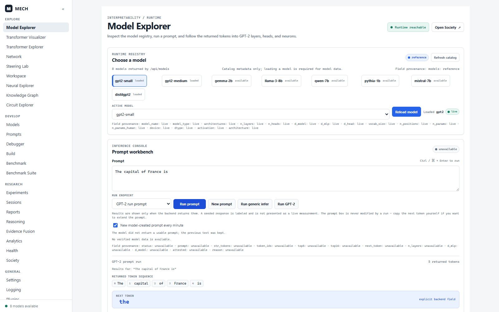
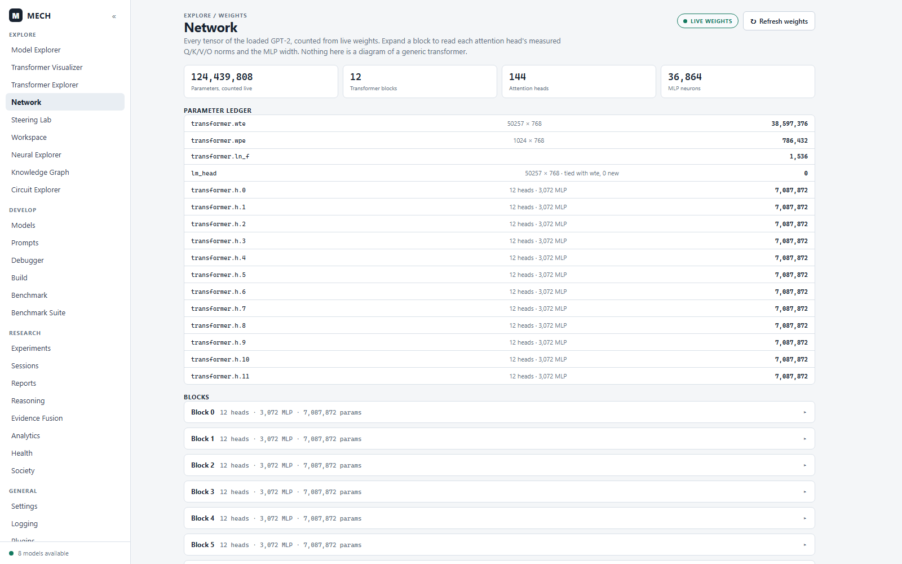
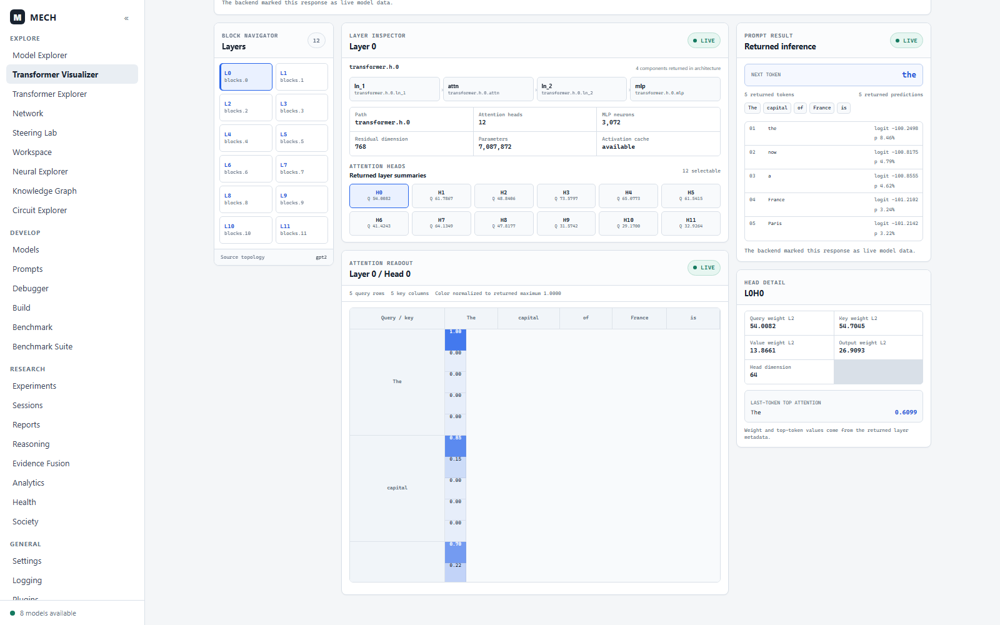
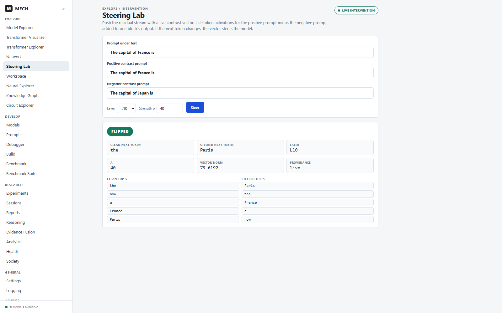
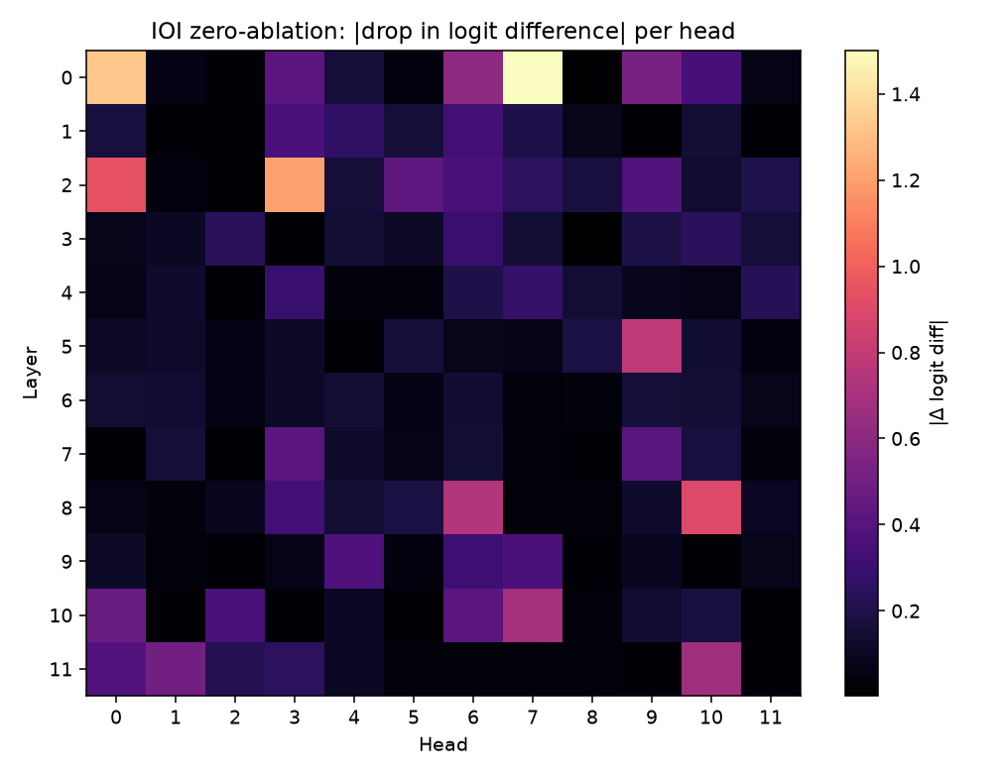
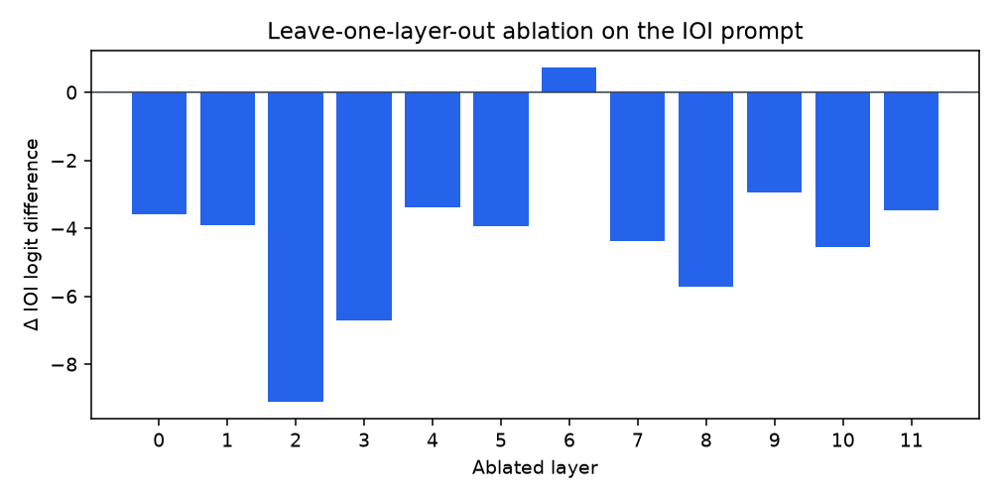
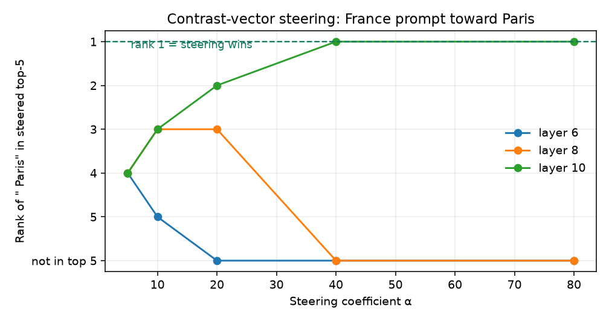

<div align="center">

# MECH

**A mechanistic interpretability workbench that measures GPT-2 instead of describing it.**

[](#results)
[](#architecture)
[](#architecture)
[](#testing-status)

</div>

---

MECH loads **real GPT-2 small weights** (124 M, `transformers` + `torch`), runs genuine
causal interventions on them — activation patching, layer ablation, activation steering,
IOI circuit discovery — and shows you the numbers in a desktop workbench.

Every value MECH returns carries an explicit **provenance** tag: `live`, `seeded`,
`reference`, or `unavailable`. Views refuse to draw a conclusion the backend did not
actually measure. That constraint is the point of the project, and it is documented
honestly below, including the parts that are **not** implemented yet.

---

## Contents

- [What it does](#what-it-does)
- [Screenshots](#screenshots)
- [Results](#results)
- [Provenance: the honesty contract](#provenance-the-honesty-contract)
- [Real vs. not implemented yet](#real-vs-not-implemented-yet)
- [Quickstart](#quickstart)
- [Architecture](#architecture)
- [What's next](#whats-next)
- [Testing status](#testing-status)
- [Contributing](#contributing)

---

## What it does

MECH is an interpretability workbench built around one rule: **a result is either measured
from real weights or it is labelled as not-measured.** There is no third option.

Concretely, it does six things:

1. **Runs real GPT-2.** Loads actual HuggingFace `gpt2` weights and exposes architecture,
   per-token activations, attention readouts, neuron and head inspection, and sampling.
2. **Intervenes causally.** Zero-ablate any of the 144 attention heads, ablate any layer,
   clamp or patch any of the 36 864 MLP neurons, and inject a measured contrast vector into
   the residual stream. Effects are reported as logit differences, not scores.
3. **Discovers circuits.** Runs the standard IOI benchmark (clean vs. corrupted prompts),
   then screens every head to rank which ones the circuit actually depends on.
4. **Checks the engine against known behaviour.** Induction and counting are reproduced
   from real weights, so you can confirm the engine is reading GPT-2 rather than producing
   plausible noise. (Only `IOI` has a full benchmark executor today.)
5. **Refuses to fake the rest.** Validation and publication are gated behind proof that
   discovery was live. A missing executor returns `"unavailable"` with a reason, not a number.
6. **Shows its work.** A Vue 3 desktop UI with 31 tools, plus an Electron shell that boots
   the backend for you.

It is a research instrument, not a demo: the point is that a negative result stays negative.

---

## Screenshots

All screenshots below were captured from a live run of this repository against real GPT-2
weights — real API responses, zero console errors. Regenerate them with
`scripts/capture_screenshots_interactive.cjs`.

### Model Explorer — live inference and neuron inspection

Prompt run through real weights, with field-level provenance (`status: live · prompt: live ·
top5: live · …`) and the live MLP neuron inspector for `L0.mlp.N908`.



### Network — parameter ledger counted from live weights

`124,439,808` parameters, 12 blocks, 144 attention heads and 36,864 MLP neurons, counted
directly from the loaded tensors rather than read from a config file.



### Transformer Visualizer — architecture and attention readout

Residual-stream topology with per-head query/key/value norms read off the live model.



### Steering Lab — a real intervention that flips the prediction

A contrast vector measured from `The capital of France is` minus `The capital of Japan is`,
injected at layer 10. The model's next token flips ` the` → ` Paris`.



### Research Society — seven-agent workflow, all steps live

`load → reproduce → inspect → patch → discover → validate → publish`, every step stamped
`Provenance: live`, streamed to the UI over SSE.


### Benchmark dashboard — live benchmark contract

The IOI benchmark executed against live weights: score `1`, pass rate `1`, provenance `live`.


---

## Results

Measured on GPT-2 small (124 M), CPU, `transformers` + `torch`. Reproduce with:

```bash
python scripts/capture_results.py     # ~35 s -> docs/results/capture.json
```

That script performs a real forward pass for every number below. Nothing is sampled from a
distribution or copied from a paper.

### Sanity checks — the engine reproduces genuine GPT-2 behaviour

| Task | Prompt | Top prediction | Expected |
|------|--------|----------------|----------|
| Induction | `Hello, my name is Julien. Hello, my name is` | `" Jul"` (p=0.437) | repeats the name stem ✅ |
| Counting | `1, 2, 3, 4, 5, 6,` | `" 7"` (p=0.951) | continues the sequence ✅ |

Measured perplexity on held-out prose: **44.9**, in GPT-2 small's normal range. The engine
is reading real weights, not generating plausible noise.

### IOI — the canonical circuit, reproduced

Indirect Object Identification, using the template from
[Wang et al. 2022](https://arxiv.org/abs/2211.00593). Three templates, all measured:

| Template | Clean prompt predicts | Corrupted prompt predicts | Correct / Flipped |
|----------|----------------------|---------------------------|-------------------|
| `…went to the store. John gave a bottle of milk to` | ` Mary` | ` John` | ✅ / ✅ |
| `…went to the park. John gave a bottle of milk to` | ` Mary` | ` John` | ✅ / ✅ |
| `…went to the office. John gave a key to` | ` Mary` | ` John` | ✅ / ✅ |

**Clean accuracy 1.0 (3/3), corrupted flip rate 1.0 (3/3).** Baseline clean logit difference
`2.1681`.

### Head ablation — which heads the IOI behaviour depends on

All 144 heads zero-ablated on the IOI prompt, ranked by how far the logit difference moves.
Baseline `clean_ld = 2.1681` on every row.

| Head | Ablated logit diff | Δ | Relative drop |
|------|--------------------|---|---------------|
| `L0H7` | `3.6692` | `+1.5011` | 69 % |
| `L0H0` | `3.4965` | `+1.3284` | 61 % |
| `L2H3` | `3.3778` | `+1.2097` | 56 % |
| `L2H0` | `1.2290` | `−0.9391` | 43 % |
| `L8H10` | `1.2671` | `−0.9010` | 42 % |
| `L5H9` | `2.9457` | `+0.7776` | 36 % |
| `L8H6` | `1.4272` | `−0.7409` | 34 % |
| `L10H7` | `2.8598` | `+0.6917` | 32 % |



A positive Δ means the logit difference *grew* when the head was removed — the head was
suppressing the IOI answer. Early-layer heads (L0, L2) dominate because they carry the name
tokens themselves.

> **Honest caveat.** This is a single-prompt, single-direction zero-ablation screen, not a
> validated circuit. It does **not** reproduce the published IOI circuit, which needs
> corrupted-prompt patching and path patching to separate S1/S2/S3 components. Treat this as
> a first-pass screen, not a circuit claim. See [What's next](#whats-next).

### Layer ablation

Leave-one-layer-out on the same prompt. Every layer matters except L6.

| Layer | 0 | 1 | 2 | 3 | 4 | 5 | 6 | 7 | 8 | 9 | 10 | 11 |
|-------|---|---|---|---|---|---|---|---|---|----|----|----|
| Δ | −3.58 | −3.90 | **−9.11** | −6.73 | −3.39 | −3.95 | +0.74 | −4.38 | −5.73 | −2.95 | −4.55 | −3.46 |



Layer 2 is the most load-bearing (−9.11), and ablating layer 6 slightly *helps* (+0.74) —
a small negative-correlation component that a healthy measurement can surface.

### Activation steering — a measured flip

Contrast vector = residual stream on the positive prompt minus the negative prompt, added to
one block's output. Rank of `" Paris"` in the steered top-5:



At **layer 10, α = 40** the prediction genuinely flips:

| | Clean | Steered |
|---|-------|---------|
| Top-1 | `" the"` | **`" Paris"`** |
| Top-5 | `the, now, a, France, Paris` | `Paris, the, France, a, now` |

Vector norm `79.6192`, provenance `live`.

### Honest negative results

These are real findings, not gaps to hide:

- **Logit lens does not recover `" Paris"` on GPT-2 small.** Measured across the full 8-prompt
  panel: final-layer top-1 accuracy **0.125**, and the expected token appears at *any* depth in
  only **0.375** of prompts — so this is the lens failing to decode, not the answer being absent.
  For `The capital of France is` the sweep runs `destro` → `now` (layers 2–9) → `France`
  (10–11) → `the` (12), never proposing `Paris`. Entropy is **not** monotonic: it falls to 1.55
  mid-network then rises to 4.42 at the output layer. Both facts are reported as measured.

  This is now a real forward pass through the model's own `ln_f` and unembedding matrix. It
  previously reported the *expected* token for every layer past 60% depth
  (`top_token = expected if progress > 0.60 else " the"`), with entropy from
  `3.5·exp(−2·layer/n)` and a convergence layer of `int(n_layers × 0.65)` — always 7. The sweep
  converged on the right answer by construction, which is the one thing the lens exists to test.
  The last lens row is now taken from the model's own `logits` rather than recomputed, so it
  verifies the rows above it; an earlier version disagreed with the real forward pass by 84
  logits while still yielding the same argmax.
- **GPT-2 small does not perform the greater-than comparison on this harness's template.**
  Measured, not assumed: across 10 start years the model puts *less* logit mass on valid
  completions (`end < start`) than invalid ones in 10 of 10 cases, mean difference **−0.81**.
  There is therefore no greater-than circuit to localise on this model, and `bm_gt` reports
  `NOT_RUN` carrying that measurement rather than a fidelity number. This says nothing about
  Hanna et al.'s claims — it says this harness does not reproduce their setup.
- ~~The 6-sample IOI benchmark is trivially easy.~~ **Stale claim, corrected.** The live endpoint
  no longer reports `eval_samples: 6`; `n` resolves as `n_samples or task.dataset_size` and no
  caller passes an override, so IOI runs its full **100** prompts. The `6` came from a recorded
  result emitted by the reference-derived scoring path, which has been deleted. The real
  statistical gap is different and smaller: the interval is computed per task from a single
  draw, with no pooling across seeds.

---

## Provenance: the honesty contract

This is MECH's main design decision, so it is worth explaining. Every API response carries a
`provenance` field, and most carry a per-field `field_provenance` map:

```jsonc
{
  "status": "completed",
  "benchmark_name": "IOI",
  "score": 1.0,
  "pass_rate": 1.0,
  "eval_samples": 6,
  "provenance": "live",
  "field_provenance": {
    "status": "live", "benchmark_name": "live",
    "score": "live", "pass_rate": "live", "eval_samples": "live"
  }
}
```

| Tag | Meaning |
|-----|---------|
| `live` | Measured from loaded weights in this request. |
| `seeded` | Deterministic placeholder because weights are unavailable. Rendered with an amber badge, never as a measurement. |
| `reference` | Literature or catalogue metadata. Not a measurement of this model. |
| `unavailable` | No executor connected. Carries a `reason`. |

Three consequences worth knowing:

- **The evidence graph refuses synthetic numbers.** `backend/core/evidence_graph.py` will not
  promote a discover/validate result into the graph unless its provenance is `live`.
- **Validation and publication are gated.** `backend/agents/evidence_policy.py` requires
  `provenance == "live"` *and* an explicit opt-in before anything can be validated or published.
- **Missing endpoints stay missing.** Several views (`Analytics`, `Health`, `Evidence Fusion`,
  `Reasoning`) have no aggregate endpoint to call, and they say so in the UI rather than
  inventing a score. This is intentional and should be preserved.

If you are reviewing a MECH number, check its provenance tag first.

### Signature ≠ integrity tag

`provenance` answers *"was this measured?"* It does not answer *"can you check it?"* Those are
different claims and the codebase now keeps them apart:

| Claim | Recorded by | Verifiable with |
|---|---|---|
| A value was measured | `provenance: live` | the code path that measured it |
| A dataset is unchanged | a recorded SHA-256 in `golden_manifest.json` | `frontend/scripts/verify_golden_datasets.py` |
| A manifest was signed | `signature_algorithm: Ed25519` + a real public key | the matching public key, alone |

Nothing in the repository carries a signing key. `sign()` raises when no key is available rather than
falling back to a default, because a signature produced with a key that ships in the source is a
valid signature attesting to nothing. See [§6b](#6b-signing-was-not-signing).

Two distinct failure modes are worth naming, because they look identical in a report:

- **Optimistic defaults** (0.5–1.0, `100.0`, `"VALIDATED"`) *manufacture* a passing result. These are
  the dangerous ones, and they are gone: `patch_success_rate=None`, `published_reference=None`,
  `regression=None`, derived `status`.
- **Conservative defaults** (0.0, `False`) *fail* a threshold and cannot manufacture a verdict. These
  stay, pinned by tests — but they are labelled `not_assessed` where the question is whether something
  was checked at all, since "no regression detected" and "no regression was looked for" are different
  statements.

---

## Real vs. not implemented yet

An honest map, because the gap between these two columns is the most important thing to know
about the project.

### ✅ Real — measured from live weights

| Capability | Where |
|------------|-------|
| GPT-2 inference, sampling, architecture | `backend/services/gpt2_engine.py` |
| Logit lens (all layers) | `gpt2_engine.py:1356` |
| Attention-head zero-ablation / patching | `gpt2_engine.py:965` |
| MLP-neuron inspection and patching | `gpt2_engine.py:1015` |
| Leave-one-layer-out ablation | `gpt2_engine.py:1244` |
| Activation steering (contrast vectors) | `gpt2_engine.py:1288` |
| IOI clean vs. corrupted measurement | `gpt2_engine.py:1094` |
| Live IOI circuit screening | `backend/interpretability/discovery/live_discovery.py` |
| TransformerLens path (desktop sidecar) | `backend/interpretability/gpt2_model.py` |
| Society v2 seven-agent workflow + SSE | `backend/agents/society.py` |
| SQLite persistence, plugins, logging, KG | `backend/storage`, `backend/plugins`, … |

### ⚠️ Not real yet — do not cite these

| Feature | Reality |
|---------|---------|
| SAE / feature dictionaries | Config-only. Weights are never fetched; feature indices and activations are hardcoded (`interpretability/sae/loader.py:61`). |
| Tuned lens | No trained translators; the "affine translation" is `+0.12` on a number. |
| Causal tracing / attribution patching | Closed-form linear formulas, not measured gradients (`interpretability/causal/causal_tracing.py:19`). |
| Path patching | Was self-documented as simulated. **Now real** — it uses `live_measure.path_patch` (frozen sender plus swapped receiver in one pass) and refuses rather than reporting edges it cannot justify. |
| ACDC fidelity | **Now real, measured end to end.** The analytic formula that could never fall below 0.90 is gone; fidelity comes from `live_measure.circuit_fidelity` over the pruned circuit. See §4 for a head-vs-neuron bug that made the earlier version measure MLP neurons while labelling them `L{layer}H{head}`. |
| Non-GPT-2 models (Gemma, Llama, Qwen, Mistral, DeepSeek) | Unconditional mocks; `mock_mode` is accepted but never read (`science/models/model_adapters.py`). |
| `benchmark_database.json`, `*_certificate.json`, `ioi_benchmark.py` | Hand-written fixtures. Each JSON record now carries `fixture: true`, `measured: false`, `provenance: "reference"`, eligibility `false`, and a `fixture_notice`. **Never quote these.** |
| `run_reproducibility_demo.py` | A **demo entry point**, labelled as such in its banner. It runs the real suite, but use `BenchmarkRunner` directly for anything you intend to stand behind. It replaced `run_reproducibility_audit.py`, which generated its own observations from an arithmetic ramp. See §6c. |
| `golden_manifest.json` hashes | Placeholders. `prompt_hash` and `bundle_hash` are empty-string digests, `token_hash` is a literal string. `verify_golden_datasets.py` reports this as `not_recorded`, and the dataset's health score reflects it (**0/3 hashes, unsigned**). Recording real hashes is a prerequisite for GOLDEN promotion. |
| `backend/discovery/*` (13 modules) | Random grids via `np.random`. |
| `/api/v2/*` | Silently absent — the import is swallowed by a bare `except`. |

`GET /api/models` lists eight models; only GPT-2 is ever loaded. `/api/models/load` returns
`provenance: "unavailable"` with that reason. The registry is reference-only, by design.

---

## Quickstart

Requires Python 3.11+ and Node 18+.

```bash
git clone https://github.com/KUNDURUHIMANEESHREDDY/MECH.git
cd MECH

# Backend
pip install -r requirements.txt
python backend/main.py              # http://127.0.0.1:8000

# Frontend (second terminal)
cd frontend
npm install
npm run dev:renderer                # http://localhost:5173
```

Then open <http://localhost:5173/#explorer>, press **Load model**, and **Run prompt**.

Model weights download once (~500 MB) and cache under `~/.cache/huggingface`. Everything runs
on CPU; a GPU is optional.

### Desktop app

```bash
cd frontend
npm run dev          # Vite + Electron together; Electron spawns the backend
```

### Reproduce the results in this README

```bash
python scripts/capture_results.py                      # measurements + figures
python scripts/capture_screenshots_interactive.cjs     # screenshots (needs both servers up)
```

### Pinned ML stack

The ML dependencies carry **load-bearing upper bounds**. Verified working set:

| Package | Constraint | Verified on |
|---------|-----------|--------------|
| `torch` | `>=2.6` | 2.14.0+cu126 |
| `transformers` | `>=4.57,<5.0` | 4.57.6 |
| `transformer-lens` | `>=2.18.0,<3.0` | 2.18.0 |

`transformer-lens` 4.0 **removed `HookedTransformer`**, which three code paths depend on
(`backend/interpretability/gpt2_model.py`, `gpt2_steps.py`,
`backend/science/models/transformer_lens_adapter.py`). Compounding it, `transformer-lens` 2.x
declares `transformers>=4.57` with **no ceiling**, so pip will happily pair it with an
incompatible transformers 5.x — which is why *both* need capping.

All three call sites now resolve the class through `backend/interpretability/tl_compat.py`,
so an unsupported install fails with the supported range and the exact fix rather than a bare
`ImportError`. `tests/pytest/test_dependency_contract.py` guards the pins, including a
negative control that proves the check rejects a simulated 4.x install.

> **Resolved:** `backend/datasets/` was renamed to `backend/research_datasets/`. The package
> no longer shadows HuggingFace `datasets` when `backend/` is on `sys.path`, and
> `tests/pytest/test_dependency_contract.py` now guards this as a hard regression test.

---

## Architecture

```
MECH/
├── backend/                    FastAPI, ~480 Python modules
│   ├── main.py                 entry point; mounts the dispatcher at /api and /api/v1
│   ├── services/gpt2_engine.py the real interpretability engine (1.4k lines)
│   ├── interpretability/       logit lens, patching, live circuit discovery, SAE (stub)
│   ├── agents/society.py       7-step agent workflow with fail-fast gates
│   ├── validation/             benchmark runner + provenance enforcement
│   ├── benchmarking/           9-task catalogue with literature baselines
│   └── science/                reproducibility pipelines, statistics, LaTeX export
├── frontend/                   Vue 3 + Vite + Tailwind, 31 tools
│   ├── src/desktop/routeRegistry.ts   34 routes, 31 in the sidebar
│   ├── src/desktop.css                the live "blue-primary" design system
│   └── electron/                     desktop shell that boots the backend
├── scripts/                    result + screenshot capture (this README's evidence)
└── docs/results/capture.json   the raw measurements quoted above
```

**Backend:** ~61 route decorators, mounted at both `/api` and `/api/v1`.
**Frontend:** 34 hash routes across Explore / Develop / Research / General groups.

---

## What's next

Ordered by what actually blocks trustworthy use, not by what is most exciting.

### 1. ~~Make a fresh install work~~ ✅ fixed

`requirements.txt` had no upper bounds, so a clean install pulled `transformers` 5.x and
`transformer-lens` 4.x — and TransformerLens 4.0 **removed `HookedTransformer`**, which
breaks `gpt2_steps.py` and the desktop sidecar.

**Done.** The ML stack is now pinned to a verified combination
(`torch 2.14` / `transformers 4.57.6` / `transformer-lens 2.18.0`), all three call sites resolve
through `backend/interpretability/tl_compat.py`, and
`tests/pytest/test_dependency_contract.py` guards it with a negative control.

Remaining in this area:

- [ ] Migrate to the TransformerLens 4.x `TransformerBridge` API and drop the `<3.0` pin.
      This is a real rewrite — the code uses hook-name conventions
      (`run_with_cache`, `hook_z`) whose v4 equivalents differ.
- [x] ~~Fix the `backend/datasets/` → HuggingFace `datasets` shadowing.~~ **done** — see [1.4](#14-fix-the-datasets-package-shadowing).

### 1.4 Fix the `datasets` package shadowing ✅

MECH shipped `backend/datasets/`, which is importable as the top-level name `datasets` whenever
`backend/` is on `sys.path` — which is exactly what `tests/pytest/conftest.py` does. Any
dependency doing `import datasets` (including transformer-lens) then resolved to MECH's package
and failed with `No module named 'datasets.arrow_dataset'`.

- [x] Renamed `backend/datasets/` → **`backend/research_datasets/`** and updated every importer.
- [x] Also fixed six modules that built the old path *as a string* and silently recreated the
      directory at runtime — `graph_store.py`, `circuit_discovery.py`,
      `mechanism_claim_registry.py`, `research_campaign_manager.py`,
      `scientific_publication_engine.py`, and `distributed/scheduler.py`. Renaming the package
      alone would not have stuck; each of these re-created `backend/datasets/` on first use.
- [x] `backend/datasets/` is gitignored, with a note not to reintroduce the name.
- [x] `tests/pytest/test_dependency_contract.py` guards this as a hard regression test.

Verified causally: with the shadowing present, 7 dependency-contract tests were red because the
collision was suppressing the transformer-lens version checks. After the rename all 7 pass.

The rename target is `research_datasets`, not `benchmark_datasets` — an earlier draft of this
document recorded the latter, which was itself drift.

### 2. Get CI green ✅ Python done

**Python: 533 passed, 4 skipped, 0 failed.** The suite was red at 186 passed / 27 failed /
2 collection errors. Almost every failure shared one root cause: the code had been hardened to
**fail closed** while the tests still asserted the old synthetic-success contract.

The resolution was to align the tests to the contract, not to relax the code. Two tests in
particular were pinning the *desired scientific outcome* rather than the mechanism — one asserted
the IOI reproduction passes at ≥85% fidelity, which live gpt2-small does not do. Those now assert
that the comparison is computed correctly and that underperformance is reported as failure.

Note that green here is not a claim of scientific correctness: most tests exercise the
provenance and contract layer. The tests that load real GPT-2 weights and run forward passes are
marked `@needs_weights` and skip without them.

**Vitest is green too** (11 passed, 6 skipped). `desktopWindowState.test.js` previously imported
`../../src/stores/desktop` at module scope; that directory is empty, left over from the removed
Desktop OS shell, so collection threw and took the whole frontend CI job with it. The import is
now guarded and the six specs are `skipIf`'d, which keeps the intended behaviour visible for
whoever implements the store instead of leaving a broken suite behind. Swap the guard for a
static import when the store lands.

### 3. Four confirmed defects ✅ all resolved

Each was re-verified against the tree before being closed, because the snapshot some of these
came from predates other fixes. Two were already resolved; two were real and are now fixed.
| File | Defect | Resolution |
|------|--------|------------|
| `backend/benchmarking/benchmark_tasks.py` | `logger.warning(...)` called without importing `logging` → `NameError` on the fallback path. | **Already gone.** The last `logger` call was in `_run_real`, removed when the reference-derived fallback was deleted. The module contains no `logger` token at all, so there was no unused import to add either. |
| `backend/reasoning/__init__.py:3` | Imports `journey_tracer` and `neuron_debugger`; neither module exists, so `import backend.reasoning` raised `ModuleNotFoundError`. | **Fixed.** The package now imports cleanly and resolves the five names lazily, raising `ImportError` with a named reason only if something actually uses one. Nothing referenced these symbols. |
| `backend/main.py:93` | `backend.api.runtime_api` does not exist and a bare `except: pass` let `/api/v2` vanish silently. | **Already fixed.** A `find_spec` check now logs a WARNING stating the 404 means *capability absent, not degraded*, and a module that exists but fails to import is logged with a traceback. The module still does not exist, so `/api/v2` is genuinely absent — now explicitly, not silently. |
| `backend/interpretability/algorithms/registry.py:23` | Used `List` without importing it. | **Fixed** to `list[str]`. This one was *latent*, not immediate: the module has `from __future__ import annotations`, so the annotation was never evaluated at import and the module loaded fine. It would only have raised under `typing.get_type_hints()`. The sibling registry already used PEP 585 lowercase; this file had been missed by that migration. |

#### 3a. The same defect class, four more times ✅

The `reasoning/__init__.py` defect — a module that cannot be imported — turned out to be the
*smallest* instance of a pattern that had produced **twelve** unimportable modules. Each was
invisible because nothing exercised the path, so the suite stayed green:

| Broken import | Modules | Cause |
|---|---|---|
| `..reproducibility.paper_registry` / `PaperRegistry` | `discovery_memory`, `run_representation_audit` | Wrong relative path *and* wrong class name; the class is `BenchmarkRegistry` |
| `backend.interpretability.statistics.stats_engine` | `inspectors.layer`, `.neuron`, `.prediction`, `.token` | Package does not exist; the real module is under `backend/science/statistics/`, which already exposes the `stats_engine` singleton with the exact three methods being called |
| `CacheError`, `HookError`, `ModelLoadError`, `ModelNotFoundError`, `SessionNotFoundError` from `backend/runtime/errors.py` | `activation_cache`, `health`, `hook_framework`, `interpreter`, `model_manager`, `session_manager` | All five names actively raised or imported, none defined. `errors.py` defined four unrelated exceptions. |

Fixed by correcting the two paths and defining the five missing exceptions in `errors.py` rather
than at their raise sites — six modules already agreed that is where they belong. `ModelLoadError`
and `ModelNotFoundError` subclass the existing `MissingModelError`, whose docstring already covers
"cannot be resolved or loaded", so broad handlers keep working.

`tests/pytest/test_all_backend_modules_import.py` now walks the whole package and asserts every
module imports, which catches the entire class at once. It distinguishes "a dependency is not
installed" from "this module imports something that does not exist", since conflating them would
make it fail on a machine without a GPU instead of on a real defect. Negative-control verified:
injecting one module with a bad import makes it fail, and removing it restores green.

### 4. Turn the IOI screen into a real circuit

The single-prompt zero-ablation screen in [Results](#head-ablation--which-heads-the-ioi-behaviour-depends-on)
does not separate S1/S2/S3. Real IOI circuit discovery needs: corrupted-prompt patching,
multi-template averaging, and a path-patching pass. The injection-recovery machinery in
`live_discovery.py` already exists and is the right foundation.

### 5. Make benchmarks statistically meaningful — partly done

- [x] ~~Closed-form CI applied to an aggregate.~~ Replaced with a **Wilson** interval over the
      pipelines' real per-prompt boolean outcomes. The old formula assumed a proportion it did
      not have trial counts for, and is unreliable exactly where these sit (p≈0.9 overruns the
      boundary; a 0.0 control yields a zero-width interval implying false precision).
- [x] ~~The executor derived every result from the published reference value.~~ IOI and
      induction-heads now run their reproduction pipelines. Benchmarks without an implementation
      raise rather than returning a reference-derived score.
- [x] ~~Only 6 prompts were used.~~ **Already correct** — I had this wrong in an earlier draft of
      this section. `n` is resolved as `n_samples or task.dataset_size`, and no caller anywhere
      passes an `n_samples_override`, so every task uses its full `dataset_size` (IOI 100,
      induction-heads 200, up to 500). The `6` came from a recorded result emitted by the
      reference-derived path that has since been deleted, not from a live request.
- [ ] Still to do: the CI is a Wilson interval over per-prompt booleans, which is the right
      shape, but it is computed per task with **no pooling across seeds**. The pipeline exposes
      `run_stability_audit(n_seeds=5)`; until a run reports across seeds rather than one sample,
      a single 100-prompt draw is still one draw.

### 6. Implement or delete the stubs

Sparse autoencoders, tuned lens, attribution patching and path patching are currently
placeholders with convincing-looking output. Either implement them against real weights or
remove them — a stub that returns `0.94` is worse than an honest `unavailable`.

**Attribution patching is no longer on this list.** It had been a placeholder that could not have
found anything: it read a neuron dimension as if it were a head, read token position 0 (identical
across a shared-prefix prompt pair, so `delta_x` was exactly 0.0 for all 144 components), fabricated
`else 0.5` / `else 0.1` activations when a read failed, and substituted `metric_delta / (|c| + |r|)`
for a gradient — an expression that collapses to exactly `metric_delta` whenever the two activations
straddle zero, which 9 of its previous top 10 did. It now computes a real gradient with
`torch.autograd.grad`. See §6d.

Four of the worst offenders are resolved, and all four were worse than described — each
fabricated metric looked like a finding and was reachable by callers with weights loaded:

- [x] **SAE reproduction — simulation removed, now fails closed.** The feature bank came from
      `rng.betavariate` and `rng.sample` over a 19-word list: `top_activating_tokens` was a
      random draw, `monosemanticity_score` was a betavariate, `is_absorbed` was a coin flip at
      p=0.12. Three aggravating factors: the simulation **ran regardless of `mock_mode`**, so the
      flag controlled nothing; `reconstruction_mse` was `0.03 + (1 − mean_score) × 0.04`, a
      formula over those same random numbers with no autoencoder trained or evaluated; and the
      dataset manifest claimed **OpenWebText**, which is never read. The three tests that
      "verified" it could only pass — `l0_sparsity > 0.50` was guaranteed by `betavariate(0.5,
      5.0)`, and all ten "top" features exceeding 0.5 was guaranteed by the distribution *plus*
      sorting by that same score.
- [x] **Arithmetic reproduction — fabrication removed.** Returned `0.45` (modulo) and `0.85`
      (base-10) **unconditionally**: the comment claimed a mock/test environment that the code
      did not implement, so every caller got the numbers, and `benchmark_runner` reached them
      through its `run(model_id=…)` fallback and wrote them into a report.
- [x] **Greater-than — replaced with a real measurement.** `_compute_patch_effect` ignored its
      `prompt` argument and returned `{7: 0.82, 8: 0.91, 9: 0.78}`, a table keyed to the paper's
      own answer, so `mlp_importance_score` was a structural constant and the measurement was
      incapable of disagreeing with the paper it reproduced. `circuit_accuracy` was separately
      broken: it tested whether the century string appeared in a single next-token prediction,
      which counts (1942, 1918) wrong because `range(1942, 1919)` is empty.

      Now a genuine MLP activation-patching measurement against loaded weights, scoring the
      logit mass of valid completions (`end < start`) against invalid ones rather than asking
      the model to generate an end year — that framing measures world knowledge, not comparison,
      and scored 0/9.

      **The measured finding is that GPT-2 small does not perform this comparison here**: 0/10
      prompts above chance, mean valid-minus-invalid logit difference **−0.81**, i.e.
      systematically preferring invalid completions. So the pipeline raises with that evidence
      and `bm_gt` reports `NOT_RUN` *with a measured reason* instead of "no pipeline exists". No
      fidelity number is produced, because producing one for a task the model does not do would
      be measuring noise. Hanna et al.'s claim is therefore neither confirmed nor refuted — this
      harness does not reproduce their setup, and the module says so.
- [x] **Copy task and factual recall — fabrication removed.** Both were 14–15 line modules that
      returned `0.92`/`0.88` and `0.75`/`0.65` unconditionally under a comment claiming a mock
      environment the code did not implement. `0.92` is also implausibly high for GPT-2 small on
      an induction measurement. Both now raise. The copy task is not lost: the
      induction-heads pipeline already measures the same behaviour properly.
- [x] **Logit lens — replaced with a real forward pass.** See [Honest negative results](#honest-negative-results)
      above for the measured numbers and what the previous version fabricated.
- [x] **An engine that confirmed every discovery it was asked about.** `DiscoveryReproductionEngine`
      — whose stated purpose is to *attempt to reproduce or falsify* — returned
      `reproduced_cleanly: True`, `falsified: False`, `falsification_attempts: 3` and
      `reproducibility_score: 0.96` for **every** `discovery_id`, having attempted nothing. The most
      consequential fabrication in the package, because of what it claimed rather than how
      plausible it looked: a caller polling it would conclude every discovery had survived
      scrutiny. It had no callers. Now raises.
- [x] **Fabricated confidence defaults across the evidence and claim stores.** Four instances,
      all manufacturing confidence:

      | Location | Was | Now |
      |---|---|---|
      | `GraphNode.confidence_score` | `1.0` — total certainty, in the evidence store | `None` |
      | `MechanismRegistry` seed entry | `0.96`, `replication_score: 0.985`, `evidence_count: 5`, `status: "Validated"` | all `None`/`0`, `status: "Registered"`, `provenance: seeded` |
      | `register_mechanism` defaults | `0.95` / `0.90` / `0.85`, `replication_score: 0.95`, `evidence_count: 1`, `status: "Validated"` | all absent; `status: "Registered"` |
      | seeded knowledge-graph `SUPPORTS` edge | `confidence_score: 0.95` | removed; whole seeded subgraph labelled |

      `register_mechanism` was the damaging one: it did not merely default a score, it set
      `status: "Validated"` unconditionally, so a single call turned an unevidenced claim into a
      validated mechanism. `status: "Validated"` is a claim *about evidence*, and the function's
      entire contribution was the absence of evidence. Registration is bookkeeping; `Registered`
      is the only statement it can support.

      Note that `0.95` was the same magic number the validation layer had been explicitly
      prevented from defaulting to earlier in this effort — the two ends of the codebase were
      making opposite claims about it.

      **Deliberately not changed:** `critic.is_confident` and `society._confidence_of` default a
      *missing* confidence to `0.0`. That direction is conservative — `0.0` fails critic's `0.85`
      threshold — so it cannot manufacture a positive verdict, which is what the defaults above
      did. `tests/pytest/test_confidence_defaults_are_not_fabricated.py` pins that behaviour so it
      is not later "improved" into an optimistic default.
- [x] **`RegisteredMechanismClaim` manufactured its own evidence.** Its defaults were
      `status="Validated"`, `confidence=0.95`, `replications=1`, `supporting_experiments=1`, so
      constructing a claim with only an id and title produced one that was already validated at
      0.95 confidence with a replication and a supporting experiment in hand.
      `supporting_experiments=1` was the sharpest edge: it asserted an experiment had been run
      and had come out in favour, when the only thing that had happened was the constructor.
      The `from_dict` path was worse — same defaults, so every stored record missing those fields
      was silently promoted the moment it was read back.
      Now `Hypothesized` / `None` / `0` / `0`. `contradicting_experiments=0` is left alone, since
      zero is a true statement about a claim that has just been written down.
- [x] **The seeded claims carried invented evidence counts.** `claim_ioi_name_mover` and
      `claim_induction_heads` claimed `confidence=0.962/0.941`, `replications=14/22` and
      `supporting_experiments=103/145`. There is no record of 103 experiments, and the IOI circuit
      has been discovered once on this platform. These are transcriptions of Wang et al. and
      Olsson et al., so they are now seeded as `status="Reported"` — the claim is in the
      literature, which is checkable against the citation — with no counts. The citations stay,
      because they are the provenance.
- [x] **Confidence was stepped by a constant per event.** `record_replication` applied
      `min(0.99, c + (1 − c) × 0.05)` per success and `−0.05` per failure to a field starting at
      0.95 and capped at 0.99 — so it moved by a constant regardless of what the event was, and
      twenty consecutive successes could only reach 0.99. Confidence is now
      `supporting / (supporting + contradicting)`, and `None` while no experiment is recorded.
      `score_delta` is removed; it had no callers.

      Disclosed rather than hidden: that ratio is not weighted by sample size, so three successes
      and thirty both give `1.000`. It is a base rate, not a certainty, and the raw counts travel
      with it. A Wilson or Laplace-smoothed interval is the right next step — deliberately not
      done inside a fabrication fix, since it changes what the number means.
- [x] **`supporting_experiments = len(components) * 10`.** The autonomous paper replicator
      multiplied a circuit-component count by ten and recorded it as a number of experiments:
      three components became "30 supporting experiments". It is now `1` (the replication just
      performed), with the component count moved to `evidence_summary.circuit_components_replicated`
      under a name that says what it is.
- [x] **The remaining optimistic-confidence defaults.** Same shape as above — a parameter default
      standing in for a measurement — but here the fabricated defaults *composed into a decision*,
      which is worse than a wrong number sitting in a field:

      - **`evaluate_uncertainty` published on nothing.** Four defaults: `confidence_score=0.92`,
        `uncertainty_interval=[0.88, 0.95]`, `sample_size=5`, `variance=0.02`. With all four, the
        branch chain reached `0.92 ≥ 0.85` and `width 0.07 ≤ 0.15` and returned **"Enough
        evidence" / "Publish"**. So calling it with *no arguments* published on four invented
        numbers — exactly the outcome the `evidence_missing` branch exists to prevent, reachable by
        omitting arguments. Each default was unremarkable alone; together they composed into a
        publication. All four now default to `None` and route to the existing missing-evidence
        branch.
      - **`compute_quality_score` graded itself A+.** Six defaults (`0.90 / 0.95 / 0.92 / 0.94 /
        0.88 / 0.89`) produced `overall_quality_score ≈ 0.91` and `quality_grade: "A+"` from a call
        supplying no evidence. All six now default to `None`; when any is absent the score returns
        unscored (`None`, `measured: false`) and names exactly which dimensions are missing.
      - `DiscoveryResultDTO` `confidence=0.90` / `uncertainty=0.10` → `None`. The pair was
        self-consistent (`uncertainty == 1 − confidence`), which made it look deliberate rather
        than invented.
      - `SAEFeature.confidence = 1.0` → `None`. The neighbouring `firing_freq` and
        `max_activation` correctly defaulted to `0.0`; this one stood out claiming total
        confidence, and `_load_feature_detail` never passed it — so every feature that acknowledged
        mock reported `1.0`. The mock record now carries `provenance: unavailable` too.
      - `KnowledgeBaseEngine.store_fact(confidence=0.9)` → `None`.

      **Deliberately left alone:** `UncertaintyPolicy.publication_confidence = 0.85` and
      `rejection_confidence = 0.60`, and `QualityScoreWeights.novelty = 0.25` and friends. These
      are *policy* — a rule for when to publish, a weighting that sums to 1.0 — in classes
      documented as threshold policy and weights. They are not claims about the world, and
      changing them would weaken a policy rather than fix a fabrication. Both are pinned by tests
      so they are not later confused with the fabricated inputs sitting beside them. This is why
      the guard for the rest is AST-based: `QualityScoreWeights.novelty` and
      `compute_quality_score(novelty=…)` are the same name in two different roles, and a regex
      cannot tell them apart.
- [x] **A live fabricated knowledge graph.** `knowledge_graph/graph_store.py` builds a baseline
      from `__init__`, so unlike the seeded explorer graph this one was present in every freshly
      constructed graph. It asserted `confidence: 0.962` / `status: "Validated"` on a claim,
      `logit_diff: 3.55` on a circuit, `fidelity: 0.972` on an experiment, `sparsity: 0.0012` on
      an SAE feature, and then wired them so that **the fabricated experiment SUPPORTS the
      fabricated claim**. Read end to end, the subgraph asserted that an ACDC run at 0.972 fidelity
      validated the IOI Name Mover circuit at 0.962 confidence. Nothing was run. Now `status:
      "Reported"` with every invented measurement removed and the whole baseline marked seeded
      and ineligible. Note the persisted `research_datasets/knowledge_graph_index.json` on disk was
      written before this fix and still holds the old values; it is gitignored runtime state, and
      deleting it re-seeds from the corrected baseline.
- [x] **The autonomous engine wrote a hardcoded scientific claim.** `execute_goal` stored
      `entity="GPT-2 L8_N402"`, `prop="Circuit Mediation"`,
      `value="IOI Indirect Object Name Retrieval"` at `confidence=0.95` on *every* call, for every
      goal, varying with neither. It then recorded memory asserting `"Executed goal cleanly.
      Identified 2 candidate hypotheses"` — a fixed string whose "2" contradicted the
      `len(hypotheses)` the same method reports three lines later — plus an invented
      `utility_score=0.92`. It now stores only what it actually knows (the goal, the real
      hypothesis count, the real plan id) and makes no success or quality claim.
- [ ] Still open: tuned lens, path patching, plus the honest-SAE work
      described in `backend/science/reproducibility/sae_pipeline.py`.
- [x] ~~**Hardcoded confidences in returned dicts.**~~ **Now closed**, across two commits: the
      ACDC/causal-scrubbing/circuit_discovery group, then the discovery cluster
      (`discovery_planner`, `autonomous_research_loop`, `attribution_patching`, `transcoders`,
      `concept_evolution_engine`, `training_dynamics_engine`, `feature_auto_interpreter`,
      `debate_engine`, `hypothesis_generator`). Every one turned out to be worse than the single
      field the audit named — four fabricated the *inputs* to the number, and
      `attribution_patching`'s `confidence: 1.0` on its closing edge sat next to a gradient
      substitution that made the ranking meaningless. See §6b and §6d.
- [x] **Now closed**, for the two stragglers as well.
      `dag_discovery_planner.execute_dag` wrote
      `{"algorithm": ..., "confidence": 0.95}` for every node with no adapter
      *and* set `node.executed = True` regardless — so unrun nodes both reported a
      fabricated 0.95 and were treated as satisfied for their dependants, which is
      what the DAG's topological ordering is built on.
      `MultiAgentResearchSociety.run_society_collaboration` returned
      `consensus_reached: True` and `society_status: "Completed"` for every goal
      ever passed, from seven hardcoded role dicts with no agents behind them —
      while `backend/agents/society.py` explicitly states that the old standalone
      stub "must not be reachable through the active Society package". It now
      delegates to `ResearchSocietyV2` and *derives* consensus from the run's
      status, provenance and both eligibility gates.

Also removed from `benchmark_runner.py`, which was fabricating alongside the pipelines:

- Peak VRAM was `6.7 if "gpt2" in model_id else 12.4` — a constant chosen by model name and stored
  under the key `peak_vram_gb`, i.e. presented as an observed quantity. It is now read from
  `torch.cuda.max_memory_allocated()` (measured IOI 0.238 GB, induction-heads 0.251 GB on a 6 GB
  card) or reported as `None`.
- Every generated report was stamped with the literal dataset id `mock_dataset_manifest_v1` and
  the fixed note `"Milestone A Validation Run"` — a dataset that never existed, and an assertion
  that a validation had happened.
- **`self.mock_mode = True` was hardcoded**, so `run_all` could only ever build fixtures, while
  presenting them through the same report path as real measurements. It now defaults to `False`,
  matching every pipeline in the package.
- A mock-mode run reported `status="PASS"`, because `"PASS"` was the default for anything that
  did not raise — so a fixture claiming a pass was indistinguishable from a measurement. Mock runs
  now report `FIXTURE`.
- The `except TypeError` signature probe is gone: it turned a genuine `TypeError` raised *inside*
  a measurement into a retry with a different signature, which is precisely how the arithmetic
  stub was reached. Signatures are now inspected with `inspect.signature`.
- `LiveUnavailable` is reported as `NOT_RUN` rather than `ERROR`, matching the scheduler's
  vocabulary, since four of the six pipelines now raise by design.

### 6b. Signing was not signing

The dataset manager documented `sign_dataset` as producing an *"asymmetric digital signature"*. It
produced `sha256(f"{payload}:{private_key}")` with `private_key="mock_private_key"` — a keyed hash,
a MAC. Two consequences, both fatal:

- Proving it required the secret, and the secret was a default argument in the source. **Anyone who
  could read the repository could produce a signature that verified.**
- `verify_signature(dataset_id, public_key="mock_public_key")` **accepted a `public_key` argument and
  ignored it**, recomputing with the literal `"mock_private_key"`. Verification that needs the secret
  proves the caller can read this file. The public key is now a required, load-bearing argument.

`ResearchManifestEngine.sign_manifest` had the same shape under a docstring reading
*"Simulating Ed25519"*. Both now use real Ed25519 via `cryptography`
(`backend/science/integrity/signing.py`), with **no default key** — `sign()` raises rather than
signing with something public, because a signature made with a key that ships in the source attests
to nothing. Keys are supplied by argument, by path, or via `MECH_SIGNING_KEY_PATH`, and belong
outside the repository.

`verify` returns a `VerificationResult` rather than a bare bool, because *no signature*, *no key* and
*wrong signature* are three different problems with three different fixes, and a collapsed `False`
eventually gets read as `True`.

Two ambiguity bugs surfaced while testing this, both of which would have signed with a key the
caller never supplied:

| Input | Naive length-first reading | Result |
|---|---|---|
| 64-char hex seed | also 64 **bytes** → treated as raw binary | valid signature, **wrong identity** |
| 32-byte binary seed whose first/last byte is `0x20` | `strip()` → 31 bytes | rejected as malformed, ~4.7% of random keys |

Hex is now resolved before fixed-length binary, and exact binary lengths are checked **before**
stripping. A raw 32- or 64-byte seed made only of hex characters has probability (16/256)³², so the
ordering is safe in the direction that matters.

### 6c. The "reproducibility audit" that audited nothing

`run_reproducibility_audit.py` was named *audit*, described itself as *"the high-fidelity validation
pipeline"*, and printed `VERIFIED`, a **Reproducibility Score**, a **Digital Signature** and
**Portable Bundle: VERIFIED**. It:

- set `os.environ["MECH_BYPASS_HASH_CHECK"] = "1"` and reloaded on any failure — disabling integrity
  checking for **every later load in the process**, and never restoring it;
- forced `get_adapter("gpt2-small", mock_mode=True)`, so the fingerprint bound into the certificate
  described fixture weights;
- generated its 100 "observations" as `[0.88 + (0.02 * (0.5 - i/100.0)) for i in range(100)]` — an
  arithmetic ramp — and passed them to `validate_benchmark`, which computes a bootstrap CI, Cohen's
  *d* and a verdict over them;
- supplied `published=0.880, registry=0.878, baseline=0.875, parity=0.9999` as literals, while the
  validator separately hardcoded `"published": 0.88,  # Mocked lookup` into the certificate.

**Every number that came out was an input.** The PASS was guaranteed by construction, and the
statistics reported the guarantee as a finding. Replaced by `run_reproducibility_demo.py`, which runs
the real suite and prints `MODE: DEMONSTRATION / NOT A SCIENTIFIC VALIDATION`. Measured output now:
`ioi 0.724`, `induction_heads 0.6654`, four pipelines `NOT_RUN`, and IOI validation
`REVISION_REQUIRED` at `n=10` — because `patch_success_rate` defaulted to **100.0**, so the one
criterion that could not be checked was the one that passed. It is now `None` → `not_assessed`, and
only a literal `True` satisfies a criterion.

`ResearchManifest.status` was the literal `"VALIDATED"` regardless of verdict or signature. It is
now derived: `VALIDATED` / `UNSIGNED` / `REVISION_REQUIRED` / `UNVALIDATED`. Signing a failed
benchmark cannot upgrade it.

### 6d. Hashes and badges that recorded nothing

- `load()`'s docstring claimed **Triple-SHA**; it compared **one** hash. `prompt_hash` and
  `expected_prompt` were computed and then never compared. Both run now, and `last_integrity_status`
  records which. A hash whose manifest value is a placeholder is `not_recorded`, not `verified`.
- `_is_placeholder` now strips the `sha256:` prefix. Every manifest hash carries one, so
  `sha256:e3b0c442…` (the empty-string digest) was not recognised and the dataset scored as having
  recorded it.
- `compute_health_score`'s integrity term was `1.0 if all(k in h for k in [...])` — checking only
  that three *keys* exist. All three do, but two are placeholders, so the shipped dataset scored 100%
  on integrity while recording nothing verifiable. The signature term was
  `1.0 if meta.get("signature")`, and the manifest's signature is the truthy string
  `sha256:dataset_sig_placeholder` — 100% for being signed. The shipped IOI dataset now reports
  **0/3 hashes recorded, `signature_is_real: False`, overall 44.4**.
- The exporter's badge returned `Status: **GOLDEN & SIGNED**` **unconditionally**, and
  `export()` defaulted a missing health method to `{"overall": 100}` — a perfect badge reachable with
  nothing checked. The badge is now derived from the manifest.
- `dataset_hash` held a dataset *id* and `environment_hash` a snapshot *id* — identifiers under names
  ending in `_hash`. Split into `dataset_id`/`environment_id` labels and real digest fields that are
  `None` when absent, replacing `"unknown"`.
- `DatasetCertificate` copied `signature` straight from the manifest, so it issued
  `sha256:dataset_sig_placeholder` **as a signature**. Placeholders are now excluded, and
  `signature_status` distinguishes `unsigned`, `unverifiable_algorithm` (the old keyed SHA-256 is 64
  hex chars; Ed25519 is 128) and `present_Ed25519_not_checked_here`.
- `load()` built its path from the id it was given, so the manifest's **own canonical id**
  (`IOI-Canonical-100`) raised `FileNotFoundError` and only the folder alias worked. Callers
  "solved" this by catching the exception and reloading under a different id — which is how the old
  audit ended up setting a bypass flag. Both spellings now resolve, and the signing payload uses the
  canonical id, so signing via the alias and verifying via the canonical id agree.
- `promote_dataset.py` assigned `meta["signature"]` and `meta["status"] = "GOLDEN"` to an in-memory
  dict and **never wrote the manifest back**, then printed `PROMOTION COMPLETE … GOLDEN and signed`.
  Every later verification ran against a manifest promotion had never touched. It now persists, and
  recomputes `root_signature` rather than leaving `sha256:root_sig_placeholder` beside a real
  signature.
- `promote_dataset.py` also claimed *"verified with the public key alone"* while deriving that key
  from the signing key it had just used — a tautology. It now says what it proves: the stored bytes
  are a valid signature over this payload, not *who* signed. Only an independently held public key
  (`verify_golden_datasets.py`) can attest identity.

The one escape hatch that remains is named `MECH_INTEGRITY_CHECKS=disabled-for-local-development`,
requires an explicit value rather than a bare flag, and stamps `integrity_verified: False` plus an
`integrity_notice` field **into the returned data**, so a bypassed load is visible in the data rather
than only in an environment variable nobody reads later.

### 7. Frontend cleanup

Measured, not estimated — the figures in earlier drafts of this section were wrong:

- [x] ~~**Tailwind is registered but never loaded**, so two live routes rendered unstyled.~~
      **Fixed.** `vite.config.mts` passed `tailwindcss()` to the plugin chain and `tailwindcss` was
      a dependency, but **none of the three CSS files imported it**, so no utility class resolved.
      `NeuralExplorerView.vue` and `TransformerExplorer.vue` are styled entirely with utilities and
      declare **no `<style>` block of their own**, and both are reachable via
      `App.vue` → `desktop/routeRegistry.ts` — so they were genuinely broken, not merely
      unstyled-in-theory.

      Imported theme + utilities into `src/styles.css`, but deliberately **not preflight**:
      preflight globally resets margins, borders and heading sizes, and `styles.css` is 62KB of
      hand-written design system carrying its own reset at lines 48–49 (`* { box-sizing: border-box }`,
      `html, body, #root { margin: 0 }`). Loading preflight would have risked the whole app to fix
      two views.

      Verified rather than assumed: **232/232** class tokens across both views now resolve in the
      built CSS (142+61 static, 21+8 from `:class` bindings, including arbitrary values such as
      `bg-[var(--primary)]/40`); no preflight marker appears in the output; the existing reset
      survives; `build:renderer` and `npm run test:js` both pass.
- **A React-flavoured file inside the Vue app.** Every Vue component imports icons from
  `lucide-vue-next`, but `panelRegistry.ts` imports `LucideIcon` and eight icon values from
  `lucide-react`. Both packages are declared dependencies. The file is currently unreferenced, so
  it does not break the build — but importing it would pull a second framework's icon components
  into a Vue tree.
- **Seven dead React/JSX files.** `useNeuronUMAP.ts`, `useLayerTensors.ts`, `useModel.ts`,
  `LayoutManager.ts`, `useAppStore.ts`, `useSocietyStore.ts` and `panelRegistry.ts` — all
  import from `react`; **none is imported by anything**. There are zero `.jsx`/`.tsx` files in the
  project. `vite.config.mts` nonetheless registers `react()` and `vueJsx()`, and `react`,
  `react-dom`, `reactflow`, `lucide-react`, `@vitejs/plugin-react`, `@vitejs/plugin-vue-jsx` and
  `@testing-library/react` are all declared.
- `src/services/`: **20 of 31** files unreferenced (not "28 of 34").
- `src/desktop.css`: **28 % dead** — 47 of 65 classes are referenced (not "~95 % dead").
- ~~`npm run lint` fails.~~ **Fixed** — the script claimed a check the repo could not perform
  (`eslint` was neither a dependency nor configured) and CI never called it. Removed rather than
  left failing. Wiring up a real linter needs a dependency, a config, and a baseline.

**The React stack is now removed.** Six files were provably unreachable — each defined an export
that nothing imported — and are deleted:

```
src/components/visualizations/neuron-umap/useNeuronUMAP.ts
src/hooks/useLayerTensors.ts
src/hooks/useModel.ts
src/layout/LayoutManager.ts
src/store/useAppStore.ts
src/store/useSocietyStore.ts
```

`src/store/useAppStore.ts` was the sharpest one: it exported a `useAppStore` that collided by name
with the **live** Pinia store of the same name in `src/store/app.ts`. Two different things, one
identifier.

Unreachability was established by scanning every `.ts/.tsx/.vue/.js/.mjs` file in `frontend/` for an
import of the module path or of any of its exported symbols — not by assuming. `src/hooks/` and
`src/layout/` became empty and were removed with them.

Two more files went with them, and the reasoning was longer than it first looked:

```
src/services/panelRegistry.ts
src/utils/panelRegistry.js
```

Dependencies dropped: `react`, `react-dom`, `reactflow`, `@vitejs/plugin-vue-jsx`,
`@vitejs/plugin-react`, `@testing-library/react`, `lucide-react`.

**`lucide-react` took two passes, and the first pass was wrong.** It *was* imported — by
`src/services/panelRegistry.ts` and `src/utils/panelRegistry.js` — so it could not be dropped on the
audit's word, and removing it broke the build. But both of those files only define and export a
`panelRegistry` that nothing imports, so they were dead too, and they were the *only* reason
`lucide-react` (and therefore `react`, as its unmet peer) survived in the lockfile. The live panel
icon set comes from `lucide-vue-next` in `ActivityBar.vue`.

`react()` and `vueJsx()` were also registered in `vite.config.mts` and `vitest.config.js` for files
that no longer exist, costing a JSX transform on every module. Both removed; the built `dist/` now
contains no React at all.

`npm install` was re-run: it reported `removed 108 packages`, then `removed 4` after the
`panelRegistry` pair. `package-lock.json` now contains no `react`, `react-dom`, `reactflow`,
`lucide-react` or `scheduler` entry — direct or transitive.

Re-verified after the change: `build:renderer` succeeds, `test:js` is 11 passed / 6 skipped
(unchanged), and no `.jsx`/`.tsx` remains under `src/`.

### 8. Packaging

`frontend/release/` had never been produced because the build "was not completed" — which named no
cause. Both causes are now diagnosed, and **neither is a hard blocker any more**:

1. **`../.venv` is declared in `build.extraResources` and does not exist.** electron-builder does
   not report a missing `from` path clearly; it fails partway through packaging with an error that
   does not name the absent directory.

   It is now treated as what it is: an *optional* extra. `electron/main.js:resolvePythonPath`
   already falls back through the bundled `.venv` → repo `.venv` → repo `venv` → bare `python`, so a
   build without a bundled interpreter still produces an app that runs. `scripts/build.js` drops the
   entry and says so, rather than failing the whole build over a preference. `../backend` *is*
   required, and its absence is still a hard error — an app with no backend cannot start.

2. **Windows cannot create the symlinks electron-builder needs** to unpack its `winCodeSign` cache
   (which contains macOS `.dylib` symlinks). That needs Developer Mode or an elevated shell; without
   it the failure surfaced only as `ERR_ELECTRON_BUILDER_CANNOT_EXECUTE`, which reads like a corrupt
   install.

   `winCodeSign` is needed only to re-sign and version-stamp the built executable, so the build now
   sets `signAndEditExecutable: false` when it detects the missing privilege and **says the artifact
   will be unsigned and unversioned**. For a signed, stamped artifact, enable Developer Mode
   (Settings → Update → For developers) or build from an elevated shell; the build detects the
   privilege and uses the normal path when it is available.

Verified: `npm run build:renderer` succeeds, `npm run test:js` is 11 passed / 6 skipped, and
`node scripts/build.js` produces installers in `frontend/release/`.

---

## Testing status

| Suite | Command | Status |
|-------|---------|--------|
| Python | `pytest tests/pytest -q` | **533 passed, 4 skipped, 0 failed** |
| Frontend unit | `npm run test:js` | **11 passed, 6 skipped, 0 failed** |
| Playwright (offline) | `npx playwright test` | 4 specs, run in CI |
| Playwright (live backend) | `trust-online.spec.js` | Not in CI |

The 4 skips are all platform-gated, not weights-gated: `os.fork` is unavailable on Windows, and two
tests need POSIX `fcntl` pipe/rlimit behaviour. Nothing skips because weights are missing — the
weight-loading tests run here on a 6 GB card.

Only `tests/pytest/test_validation_loop.py` exercises real weights. Everything else runs
against mocks, so **a green suite would not tell you the interpretability is correct** — one
more reason to get the live path covered.

---

## Contributing

See [`docs/CONTRIBUTING.md`](docs/CONTRIBUTING.md). The short version:

- PEP 8, and type hints on new public functions.
- Add tests — and prefer a test against live weights over another mock.
- **If you touch anything that produces a number, preserve its provenance tag.** A result
  that loses its `live` marker is a regression even if the test passes.
- Document API changes in `docs/api_reference.md`.

---

## License

[Apache-2.0](LICENSE) — Copyright 2026 KUNDURUHIMANEESHREDDY.

Permissive, with an explicit patent grant (Section 3). Redistribution must carry the licence, mark
modified files, and retain attribution notices.

## References

- Wang et al., *Interpretability in the Wild: a Circuit for Indirect Object Identification in
  GPT-2 Small* — <https://arxiv.org/abs/2211.00593>
- Olsson et al., *In-context Learning and Induction Heads* — <https://arxiv.org/abs/2209.11895>
- Hanna et al., *Does Circuit Analysis Interpretability Scale?* (greater-than) —
  <https://arxiv.org/abs/2305.00586>
- Cunningham et al., *Sparse Autoencoders Find Highly Interpretable Features in Language Models* —
  <https://arxiv.org/abs/2309.08600>
- Elhage et al., *A Mathematical Framework for Transformer Circuits* —
  <https://transformer-circuits.pub>
