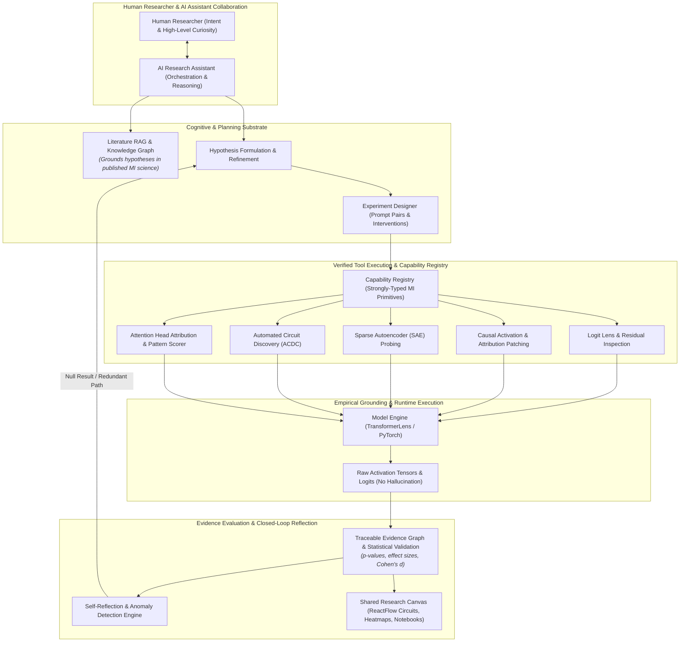

# MECH AI Research Assistant Layer: Architectural Specification

## Overview

The **AI Research Assistant Layer** transforms MECH from a passive interpretability dashboard into an **AI-native autonomous research environment**. 

Rather than requiring human researchers to manually script and inspect every single layer, hook, and tensor, MECH pairs the human with an intelligent research assistant capable of formulating hypotheses, designing counterfactual experiments, invoking verified mechanistic tools, reflecting on empirical results, and co-piloting the discovery of neural circuits.



---

## 1. Core Architectural Pillars

### 1.1 Verified Capability Registry (`backend/core/capability_registry.py`)
All mechanistic interpretability primitives are registered as strongly-typed, sandboxed tools. The AI assistant does not invent synthetic metrics; it queries the capability registry to discover available tools and executes them with validated parameter schemas.

* `inspect_residual_stream(prompt, layers)`
* `run_logit_lens(prompt)`
* `run_activation_patching(clean_prompt, corrupted_prompt, target_token, component_type)`
* `extract_sae_features(layer, activation_type, top_k)`
* `run_acdc_circuit_discovery(dataset, threshold)`
* `compute_head_attribution(prompt, target_head)`

### 1.2 Empirical Grounding (Anti-Hallucination Engine)
A central design principle is that **scientific claims are computed, not hallucinated**:
* When the assistant claims *"Layer 8 Head 9 accounts for 48% of the indirect object logit difference"*, that number originates from a live PyTorch tensor execution on the loaded weights.
* Results are immutably logged with exact random seeds, model hashes, and tensor dimensions.

### 1.3 Literature RAG & Knowledge Graph (`backend/research_platform/meta/literature_learning_pipeline.py`)
Grounds the assistant in established mechanistic interpretability literature:
* Ingests papers on Toy Models of Superposition, Sparse Autoencoders, Causal Mediation Analysis (ROME), Induction Heads, and Automated Circuit Discovery.
* Vector embeddings allow the agent to reference proven methodologies when designing experiments for novel phenomena.

### 1.4 Agent Orchestration & Society (`backend/agents/research_society.py`)
The assistant coordinates specialized sub-agent roles to maintain rigorous scientific methodology:
* **Planner Agent:** Breaks down high-level research questions into concrete multi-step experimental agendas.
* **Experiment Designer:** Automatically crafts clean vs. corrupted prompt pairs and specifies hook locations.
* **Critic Agent:** Reviews experimental designs for confounding variables, baseline leakage, and statistical underpowering.
* **Consensus & Uncertainty Manager:** Quantifies empirical confidence intervals and triggers follow-up experiments when evidence is inconclusive.

### 1.5 Closed-Loop Self-Reflection (`backend/research_platform/meta/self_reflection_engine.py`)
Science is iterative. When an experimental intervention fails or produces unexpected results:
* The self-reflection engine identifies null results.
* Evaluates alternative mechanisms (e.g., redundant backup heads, distributed polysemantic circuits, non-linear MLP compensation).
* Automatically formulates the next refined hypothesis.

### 1.6 Shared Human-Agent Workspace
The assistant is deeply integrated into the React 18 / Electron desktop UI:
* When the agent discovers a circuit, it directly renders the interactive node graph on the **ReactFlow Canvas**.
* Intermediate token predictions are piped directly into the **Prediction Panel**.
* Research findings are structured into an editable **Interactive Research Notebook** with exportable LaTeX figures.

---

## 2. Canonical Research Workflow

```text
User Question: "Why does the model hallucinate on prompt X?"
                      ↓
[1. AI Assistant Formulation] → Ingests prompt, queries literature RAG
                      ↓
[2. Logit Lens Analysis]     → Executes tool: locates critical layer divergence
                      ↓
[3. Causal Patching]         → Executes tool: isolates critical Heads and MLPs
                      ↓
[4. SAE Decomposition]       → Executes tool: extracts monosemantic feature dictionary
                      ↓
[5. Circuit Synthesis]       → Assembles minimal causal graph in Evidence Graph
                      ↓
[6. Causal Intervention]     → Clamps/ablates features; measures behavioral shift
                      ↓
[7. Empirical Reflection]    → Verifies statistical significance (p < 0.01)
                      ↓
[8. Synchronized Output]     → Renders circuit on Canvas + writes LaTeX report draft
```

---

## 3. Summary

By uniting **verified tool execution**, **literature RAG**, **multi-agent orchestration**, and **empirical self-reflection**, MECH delivers a true **AI-native research studio** that accelerates mechanistic discovery from weeks of manual scripting down to minutes of collaborative, verifiable investigation.
